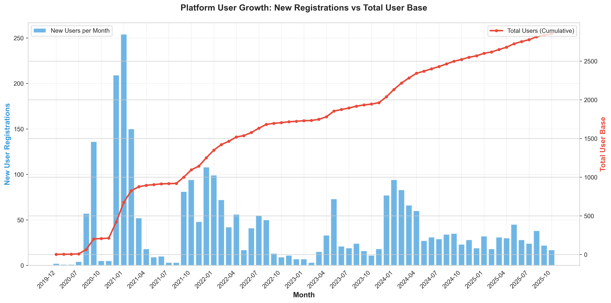
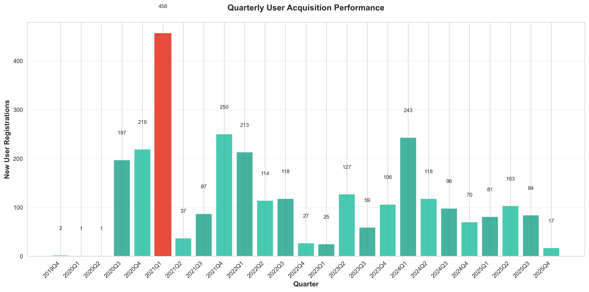
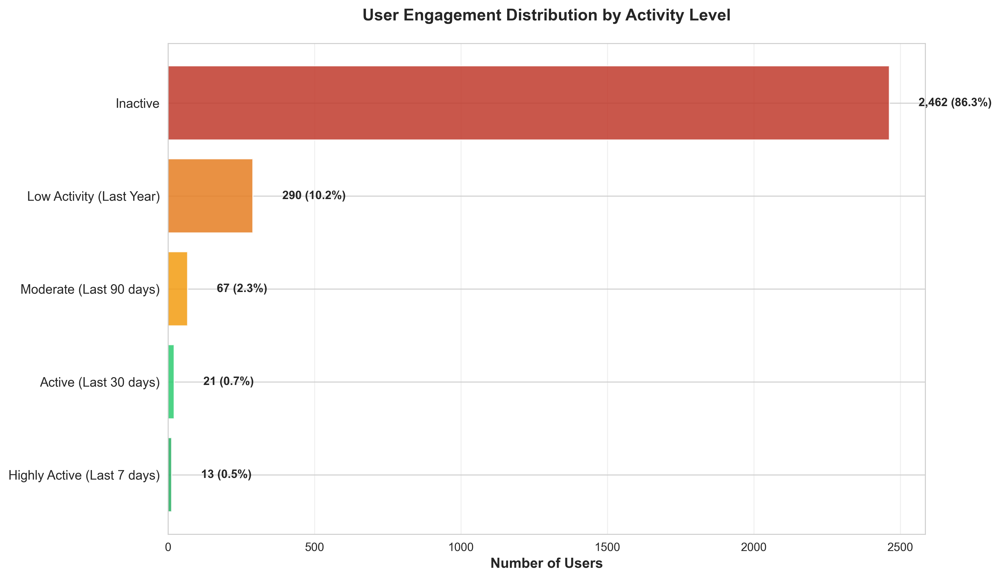
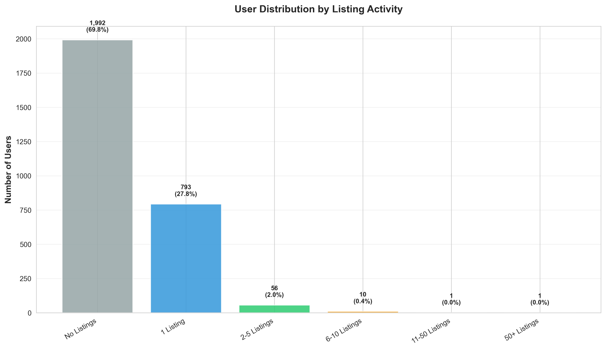
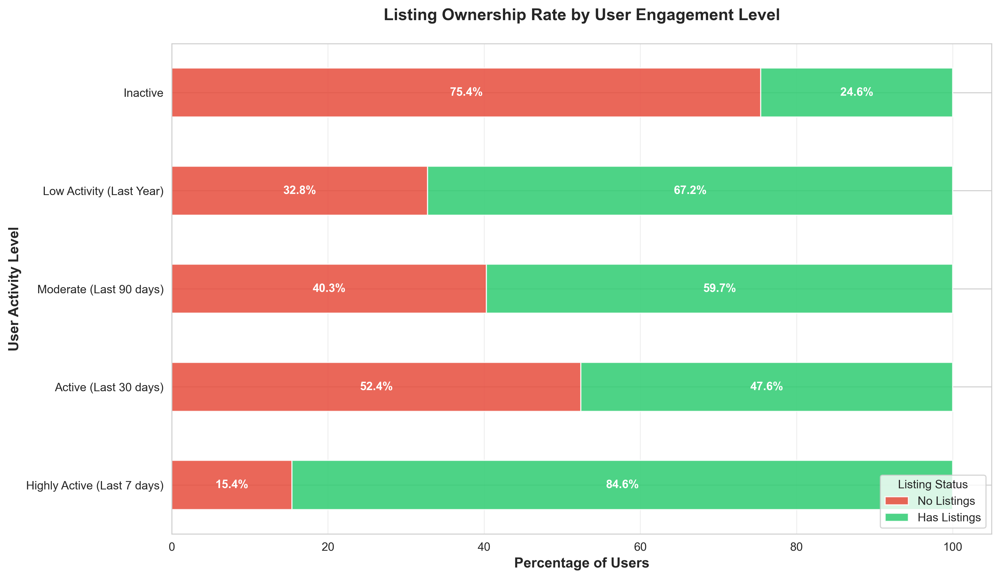
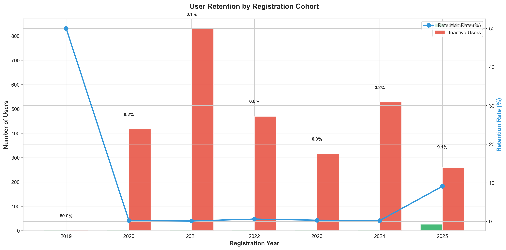
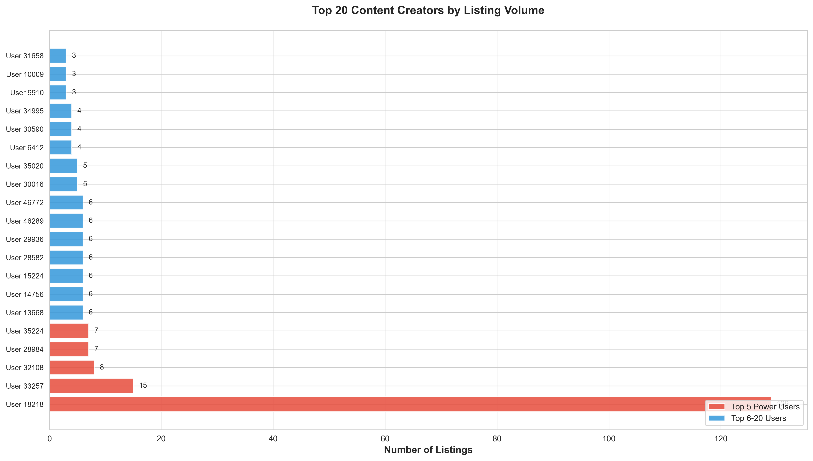
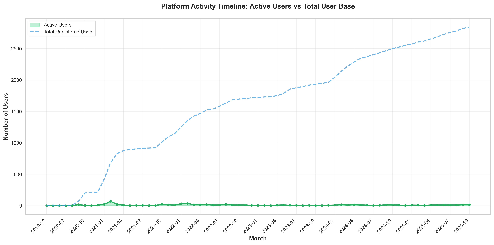

# Mojo.az Platform Analytics: Executive Business Insights

## Executive Summary

This analysis examines user behavior and platform health across 2,853 registered users on the Mojo.az marketplace platform. The data reveals **critical retention challenges** alongside opportunities for strategic intervention to revitalize user engagement and accelerate platform growth.

### Key Findings at a Glance

- **Retention Crisis**: Only 1.2% of users remain active (last 30 days)
- **User Base**: 2,853 total registered users
- **Content Creators**: 30.2% of users have created listings
- **Growth Status**: Platform peaked in 2021, requiring re-engagement strategy
- **Opportunity**: 86% inactive user base represents significant reactivation potential

---

## Critical Business Insights

### 1. Platform Growth Trajectory Shows Peak and Decline

**What This Shows:**
The platform experienced steady user acquisition from 2019 through mid-2021, reaching its peak registration period. However, new user registrations have significantly declined in recent periods.

**Why This Matters:**
- User acquisition momentum has stalled, indicating potential issues with market awareness, competitive pressure, or value proposition
- The declining trend suggests the platform is losing market share or failing to attract new users
- Without intervention, the platform risks becoming dormant

**Business Impact:**
- Growth has plateaued, limiting revenue potential and market expansion
- Acquisition costs may be rising while conversion rates decline
- Platform may be losing competitive positioning in the marketplace

**Recommended Actions:**
- Launch targeted marketing campaigns to restart user acquisition
- Investigate competitor strategies and market changes since 2021
- Develop referral programs to leverage existing user base
- Reassess value proposition and user onboarding experience

---

### 2. 2021 Was Peak Performance Year - What Changed?

**What This Shows:**
Quarterly registration data clearly identifies 2021 as the platform's strongest year for user acquisition, with certain quarters showing exceptional performance.

**Why This Matters:**
- Understanding what drove 2021 success is critical to replicating it
- The subsequent decline indicates external market shifts or internal platform issues
- Identifying the inflection point can reveal root causes

**Business Impact:**
- Lost momentum translates directly to lost revenue opportunities
- Platform brand strength may be eroding in the market
- Competitors may have captured market share during the decline period

**Recommended Actions:**
- Conduct deep-dive analysis: What made 2021 successful?
- Review marketing spend, campaigns, and partnerships from that period
- Identify what changed in 2022-2023 (product, market, competition)
- Develop recovery strategy based on historical success factors

---

### 3. Severe User Engagement Crisis: 86% Inactive

**What This Shows:**
The overwhelming majority of registered users (2,462 out of 2,853) are completely inactive. Only 13 users qualify as "highly active" with platform activity in the last 7 days.

**Why This Matters:**
This is the **most critical finding** in the analysis:
- A 1.2% retention rate indicates fundamental platform or product issues
- The platform is essentially operating with fewer than 50 truly engaged users
- Without addressing retention, no growth strategy will succeed

**Business Impact:**
- Revenue generation is severely limited by tiny active user base
- Platform network effects cannot materialize with this activity level
- High churn suggests poor product-market fit or user experience issues
- Marketing spend is wasted if users immediately disengage

**Recommended Actions:**
**IMMEDIATE PRIORITY:**
1. Conduct urgent user research to understand why users disengage
2. Implement win-back campaigns for recently inactive users
3. Overhaul onboarding process to increase initial engagement
4. Add retention metrics to executive dashboard with weekly review
5. Consider product pivots or major UX improvements based on user feedback

---

### 4. Content Creation: Untapped Potential

**What This Shows:**
While 30.2% of users have created listings (861 users), the majority (69.8%) have never posted content. Among content creators, most have only 1-5 listings.

**Why This Matters:**
- The platform has successfully converted nearly one-third of users into content creators
- However, there's massive untapped potential in the 70% who haven't created listings
- Low listing counts suggest barriers to content creation or lack of motivation

**Business Impact:**
- Limited inventory restricts marketplace attractiveness to buyers
- Low content creation reduces platform value and network effects
- Revenue per user is lower than potential

**Recommended Actions:**
- Reduce friction in listing creation process
- Implement incentive programs for first-time sellers
- Provide templates, guides, and support for listing creation
- Analyze successful creators to identify replicable patterns
- Test gamification or rewards for content contribution

---

### 5. Engagement Strongly Correlates with Content Creation

**What This Shows:**
Users who create listings are significantly more likely to remain active on the platform compared to those who only browse.

**Why This Matters:**
- Content creation drives retention and engagement
- Converting users from browsers to sellers should be a key strategic priority
- The platform creates more value for users when they actively participate

**Business Impact:**
- Seller engagement creates sustainable, high-value users
- Transaction fees from active sellers drive revenue
- Active sellers create inventory that attracts buyers, creating a growth flywheel

**Recommended Actions:**
- Develop explicit "browser-to-seller" conversion funnel
- Create first-listing incentives (reduced fees, promotion, etc.)
- Simplify listing process to reduce activation barriers
- Send targeted campaigns to engage browsers with seller benefits
- Track and optimize "time to first listing" metric

---

### 6. Retention Failure Across All User Cohorts

**What This Shows:**
Every annual registration cohort, from 2019 to 2025, shows extremely poor retention rates. Even recent users are disengaging at alarming rates.

**Why This Matters:**
- The retention problem is not isolated to old users—it affects all cohorts
- This indicates systemic platform issues rather than temporary market conditions
- Even "fresh" users are abandoning the platform quickly

**Business Impact:**
- Cannot build sustainable business without retaining users
- Customer Lifetime Value (LTV) is minimal, making acquisition economics unfavorable
- Platform cannot compound growth if new users immediately churn

**Recommended Actions:**
**STRATEGIC PRIORITY:**
1. Declare retention as #1 company priority
2. Form dedicated retention task force
3. Implement comprehensive user journey analysis
4. Deploy engagement triggers (notifications, emails, in-app messages)
5. Create value demonstration loops to show users platform benefits
6. Consider major product or business model changes if retention doesn't improve

---

### 7. Platform Dependent on Handful of Power Users

**What This Shows:**
Content creation is heavily concentrated among a small group of power users. The top creator has 129 listings, while the 20th has significantly fewer.

**Why This Matters:**
- Platform success is dangerously dependent on very few individuals
- Loss of any top creator would materially impact platform inventory
- This concentration indicates limited ecosystem diversity

**Business Impact:**
- **High Business Risk**: Platform vulnerable to power user departure
- Limited marketplace diversity may reduce buyer appeal
- Difficult to scale if growth depends on finding more "super users"

**Recommended Actions:**
- Develop VIP program to retain and support power users
- Create incentives to grow the "mid-tier" creator segment
- Reduce dependency through broader creator recruitment
- Study power user behaviors to enable replication
- Implement creator success programs to develop more high-volume sellers

---

### 8. Active User Base Declining Over Time

**What This Shows:**
While total registered users grew steadily through 2021, the count of monthly active users has significantly declined, creating a widening gap between total users and active users.

**Why This Matters:**
- Platform is accumulating "dead weight" of inactive accounts
- Active user decline indicates worsening product-market fit or competitive pressure
- The gap represents failed activation and retention

**Business Impact:**
- Real platform value is much lower than registration numbers suggest
- Declining activity reduces marketplace liquidity and transaction volume
- Revenue generation capacity is shrinking despite user base growth

**Recommended Actions:**
- Focus metrics on active users rather than total registrations
- Launch aggressive reactivation campaigns
- Implement lifecycle marketing to prevent inactivity
- Analyze why active users are declining and address root causes
- Consider platform refresh or relaunch to re-engage dormant users

---

## Strategic Recommendations

### Immediate Actions (0-30 Days)

1. **Declare Retention Emergency**: Make user retention the top company priority with executive accountability
2. **User Research Sprint**: Interview 50+ inactive users to understand disengagement drivers
3. **Quick Wins**: Deploy immediate engagement tactics (email campaigns, push notifications, special offers)
4. **Dashboard Setup**: Create real-time retention and engagement monitoring

### Short-Term Initiatives (1-3 Months)

1. **Onboarding Overhaul**: Redesign user journey to drive activation and first-listing creation
2. **Content Creation Push**: Launch incentive programs to convert browsers to sellers
3. **Win-Back Campaign**: Targeted reactivation for recently inactive users (30-90 days)
4. **Power User Protection**: Implement VIP support program for top creators

### Medium-Term Strategy (3-6 Months)

1. **Product Improvement**: Based on user feedback, implement UX enhancements
2. **Growth Relaunch**: New marketing campaign to restart user acquisition
3. **Community Building**: Create engagement loops beyond transactions (forums, events, content)
4. **Analytics Infrastructure**: Implement predictive churn models and intervention systems

### Long-Term Vision (6-12 Months)

1. **Platform Evolution**: Consider strategic pivots if retention doesn't improve
2. **Ecosystem Development**: Build tools, integrations, and services that increase platform stickiness
3. **Market Repositioning**: Evaluate if target market or value proposition needs adjustment
4. **Sustainability Model**: Achieve target metrics (>40% retention, 50%+ creator conversion)

---

## Risk Assessment

### Critical Risks

| Risk | Severity | Probability | Mitigation |
|------|----------|-------------|------------|
| Platform becomes dormant due to continued user decline | **CRITICAL** | High | Immediate retention intervention |
| Power user departure impacts inventory | High | Medium | VIP retention program |
| Unable to restart growth trajectory | High | High | Marketing relaunch + product refresh |
| Competitive displacement | High | Medium | Market analysis + differentiation strategy |

### Opportunities

| Opportunity | Impact | Effort | Priority |
|-------------|--------|--------|----------|
| Reactivate 2,400+ inactive users | **MASSIVE** | Medium | **HIGH** |
| Convert 70% non-creators to sellers | High | Medium | **HIGH** |
| Replicate 2021 success factors | High | Low | **HIGH** |
| Develop mid-tier creator segment | Medium | Medium | Medium |

---

## Success Metrics to Track

### North Star Metric
**Monthly Active Users (MAU)** - Currently 34, Target: 500+ within 6 months

### Supporting Metrics
- **30-Day Retention Rate**: Currently 1.2%, Target: 40%+
- **Creator Conversion Rate**: Currently 30.2%, Target: 50%+
- **Average Listings per Creator**: Currently 1.3, Target: 3+
- **Monthly New Registrations**: Currently ~20, Target: 200+
- **Reactivation Rate**: Currently unknown, Target: 15%+ monthly

---

## Conclusion

The Mojo.az platform faces a **critical retention and engagement crisis** that threatens long-term viability. However, the data also reveals significant opportunities:

- **2,400+ inactive users** represent a massive reactivation opportunity
- **Proven success in 2021** demonstrates the platform can work under the right conditions
- **30% creator conversion** shows some users find value in the platform
- **Concentrated power users** prove the platform can serve high-volume creators

**The path forward requires immediate, decisive action on retention**, followed by strategic initiatives to restart growth and rebuild engagement. Without addressing the 1.2% retention rate, no growth strategy will succeed.

This is a **turnaround situation** requiring urgent executive focus, resource allocation, and willingness to make significant product or strategy changes based on user feedback.

---

## Appendix: Data Overview

- **Analysis Date**: October 30, 2025
- **Dataset Size**: 2,853 users
- **Time Period**: December 2019 - October 2025
- **Total Listings**: 1,136
- **Active Creators**: 861 (30.2%)
- **Methodology**: User activity defined as any platform engagement within 30 days

**Charts Generated**: 8 business insight visualizations
**Script**: `generate_charts.py` (run to regenerate with updated data)
